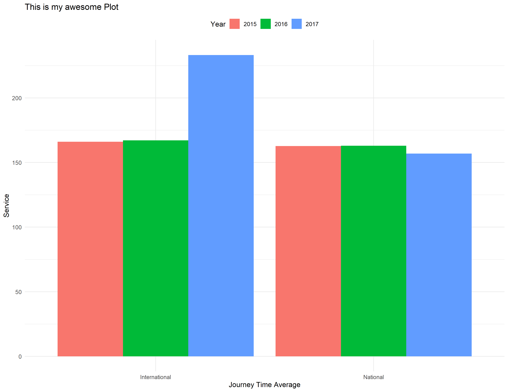

--- 
title: "My Amazing Thesis"
output:
  bookdown::pdf_document2:
    toc: no
    latex_engine: xelatex
  bookdown::word_document2:
    fig_caption: yes
    reference_docx: styles/Brain_template.docx
link-citations: yes
linkcolor: blue
citecolor: orange
#bibliography: styles/EEG_fNIRS.bib
#csl: styles/styles-master/spectroscopy-letters.csl
---


```{r setup, include=FALSE, cache=FALSE, echo=FALSE}
if (!require("pacman")) install.packages("pacman")
pacman::p_load(apastats,kableExtra,citr,tidyverse,dplyr,radiant)


load("data/analyzedData.RData") #load our saved data
use_betterbiblatex = TRUE

# Renaming a column ================
journeyTime <- journey_time	%>% 
  dplyr::rename(
    "Service" = "service",
    "Journey Time" = "journey_time_avg",
    "Year" = "year",
    "SD" = "sd",
    "SE" = "se",
    "CI" = "ci"
  )

journeyTime <- round_df(journeyTime, digits = 1)
```

```{r global_options, echo=FALSE}
library(knitr)
knitr::opts_chunk$set(fig.pos = 'H',
                      fig.path = 'images/',
                      fig.align = 'center',
                      echo = FALSE, 
                      warning = FALSE, 
                      message = FALSE,
                      include = TRUE,
                      out.width = ".9\\textwidth",
                      out.height = ".9\\textheight",
                      dpi = 300)
```


# Results

There was a significant effect of service on the average journey time `r describe.aov(model, "service", sstype = 2)`.
Descriptive statistics were run and are shown in Table \@ref(tab:journeyTime) below 
```{r journeyTime}
knitr::kable(journeyTime, longtable=T, caption = "Descriptives", escape=F, booktabs=T, format="latex")
```
A plot is shown in  Figure \@ref(fig:myFigure)
```{r myFigure, fig.cap = "Caption for my Figure"}

```